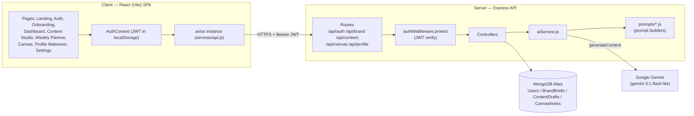
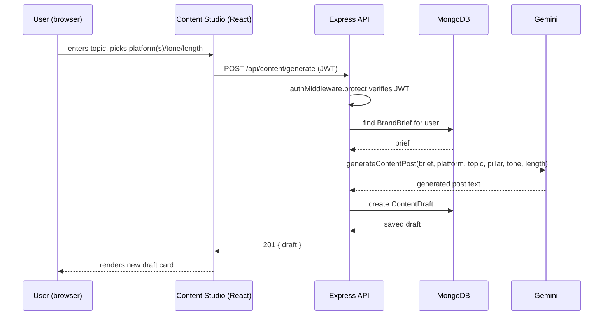

# High-Level Design (HLD) — BrandPilot AI

## 1. Architecture Overview

BrandPilot AI is a standard three-tier web application: a React single-page app, a Node/Express
REST API, and MongoDB for storage — with a Google Gemini model as an external AI service the
backend calls into for every generation feature.

## 2. Tech Stack

| Layer | Choice | Why |
|---|---|---|
| Frontend | React 19 + Vite, React Router v7, Tailwind CSS v4 | Fast dev loop, file-based routing is simple enough not to need a meta-framework for this app's size |
| State | React Context (`AuthContext`) + local component state | App state is shallow (auth session + per-page data fetches) — no need for a global store |
| Backend | Node.js + Express | Simple REST surface, matches the team's existing JS skillset end-to-end |
| Database | MongoDB (Atlas) via Mongoose | Brand briefs / drafts / notes are naturally document-shaped and evolve per-feature (e.g. `pillarWeights` added later without a migration) |
| Auth | JWT (`jsonwebtoken`) + `bcrypt` password hashing | Stateless auth, no session store needed |
| AI | Google Gemini (`@google/genai`, `gemini-3.1-flash-lite`) | Fast, cheap model sufficient for short-form content generation; JSON-mode-style prompting used for structured outputs |

## 3. Major Modules

1. **Auth module** (`authRoutes` / `authController` / `authMiddleware`)
   Signup, login, and `GET /me`. Issues a JWT on login containing the user id; `protect`
   middleware verifies it and attaches `req.user` on every subsequent protected route.

2. **Brand module** (`brandRoutes` / `brandController` / `BrandBrief` model)
   Turns onboarding answers into a structured Brand Brief via the AI service, and lets the user
   read/update it afterward (including pillar weights). This is the "brain" every other module
   reads from.

3. **Content module** (`contentRoutes` / `contentController` / `ContentDraft` model)
   The largest module — single/multi-platform post generation, content idea generation,
   AI-driven weekly planning, per-draft AI refinement actions, scheduling, and status
   management (draft → scheduled → posted).

4. **Canvas module** (`canvasRoutes` / `canvasController` / `CanvasNote` model)
   Freeform note capture plus an AI "analyze board" action that summarizes notes and suggests
   content angles, using the Brand Brief for context.

5. **Profile module** (`profileRoutes` / `profileController`)
   Stateless — takes a headline/About pasted in, returns an AI-rewritten version. Nothing is
   persisted here; the user copies the result out.

6. **AI service layer** (`services/aiService.js`)
   The single integration point with Gemini. Every other controller calls into this layer
   rather than talking to the AI SDK directly, and every prompt is built by a dedicated
   `prompts/*.js` function so prompt text stays out of controller logic.

## 4. Cross-Cutting Design Decisions

- **Brand Brief as the single source of truth.** Every generation call (content post, content
  idea, weekly plan, profile rewrite, canvas analysis) takes the user's `BrandBrief` as an
  input to its prompt. There is intentionally no code path that generates content without it —
  this is what keeps output on-brand instead of generic.
- **Prompt/service/controller separation.** `prompts/*.js` are pure functions that return a
  prompt string; `aiService.js` owns all Gemini calls, model selection, and response
  parsing/error handling; controllers own HTTP concerns (validation, status codes, persistence).
  This keeps any one file small and makes prompts independently testable/tunable.
- **Scheduling reuses the draft model instead of a parallel one.** The Weekly Planner does not
  have its own database table — a "scheduled" post is just a `ContentDraft` with a
  `scheduledDate` and `status: "scheduled"`. This avoids two systems of record for the same
  content and made the AI auto-planner a straightforward extension of the existing
  generate → save pattern.
- **Route protection on the client mirrors the server.** The server already rejects
  unauthenticated requests via `authMiddleware.protect`; `ProtectedRoute` on the client adds the
  same guard at the routing layer so logged-out users are redirected before a page even
  attempts a doomed API call.

## 5. Data Flow — Example: Generating a Content Post

## 6. Deployment Model (current)

Local development only at this stage: Vite dev server for the client, `node server.js` for the
API, connecting to a MongoDB Atlas cluster over the internet. Environment variables
(`MONGO_URI`, `JWT_SECRET`, `GEMINI_API_KEY`, `PORT`) are loaded from a root `.env` file via
`dotenv`. No CI/CD or hosting is configured yet — the client (`vite build`) and server are
deploy-ready as static assets + a Node process respectively, but that wiring is future work.
