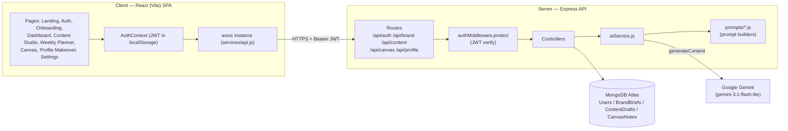
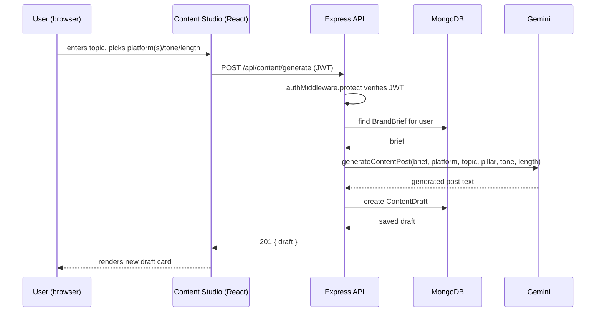

# High-Level Design (HLD) — Verve AI

## 1. Architecture Overview

Verve AI is a standard three-tier web application: a React single-page app, a Node/Express
REST API, and MongoDB for storage — with a Google Gemini model as an external AI service the
backend calls into for every generation feature.

## 2. Tech Stack

| Layer | Choice | Why |
|---|---|---|
| Frontend | React 19 + Vite, React Router v7, Tailwind CSS v4 | Fast dev loop, file-based routing is simple enough not to need a meta-framework for this app's size |
| State | React Context (`AuthContext`) + local component state | App state is shallow (auth session + per-page data fetches) — no need for a global store |
| Backend | Node.js + Express | Simple REST surface, matches the team's existing JS skillset end-to-end |
| Database | MongoDB (Atlas) via Mongoose | Brand briefs / drafts / notes are naturally document-shaped and evolve per-feature (e.g. `pillarWeights` added later without a migration) |
| Billing database | PostgreSQL via Prisma | Billing/subscriptions are inherently relational (plans, subscriptions, invoices with real FKs and transactional writes) — a deliberate second datastore for just this slice rather than forcing a relational domain into documents; see LLD.md §1a |
| Cache | Redis (`ioredis`) | Optional — caches hot per-user reads (content list, analytics overview); the app runs correctly without it, just uncached |
| Real-time | Socket.IO | JWT-authenticated, keeps multiple open tabs for the same account in sync on draft/billing changes |
| Auth | JWT (`jsonwebtoken`) + `bcrypt` password hashing | Stateless auth, no session store needed |
| Payments | Stripe (Checkout + webhooks) | Test-mode subscription checkout for the billing feature |
| AI | Google Gemini (`@google/genai`, `gemini-3.1-flash-lite`) | Fast, cheap model sufficient for short-form content generation; JSON-mode-style prompting used for structured outputs |

## 3. Major Modules

1. **Auth module** (`authRoutes` / `authController` / `authMiddleware`)
   Signup, login, and `GET /me`. Issues a JWT on login containing the user id; `protect`
   middleware verifies it and attaches `req.user` on every subsequent protected route.

2. **Brand module** (`brandRoutes` / `brandController` / `BrandBrief` model)
   Turns onboarding answers into a structured Brand Brief via the AI service, and lets the user
   read/update it afterward (including pillar weights). This is the "brain" every other module
   reads from.

3. **Content module** (`contentRoutes` / `contentController` / `ContentDraft` model)
   The largest module — single/multi-platform post generation, content idea generation,
   AI-driven weekly planning, per-draft AI refinement actions, scheduling, and status
   management (draft → scheduled → posted).

4. **Canvas module** (`canvasRoutes` / `canvasController` / `CanvasNote` model)
   Freeform note capture plus an AI "analyze board" action that summarizes notes and suggests
   content angles, using the Brand Brief for context.

5. **Profile module** (`profileRoutes` / `profileController`)
   Stateless — takes a headline/About pasted in, returns an AI-rewritten version. Nothing is
   persisted here; the user copies the result out.

6. **AI service layer** (`services/aiService.js`)
   The single integration point with Gemini. Every other controller calls into this layer
   rather than talking to the AI SDK directly, and every prompt is built by a dedicated
   `prompts/*.js` function so prompt text stays out of controller logic.

## 4. Cross-Cutting Design Decisions

- **Brand Brief as the single source of truth.** Every generation call (content post, content
  idea, weekly plan, profile rewrite, canvas analysis) takes the user's `BrandBrief` as an
  input to its prompt. There is intentionally no code path that generates content without it —
  this is what keeps output on-brand instead of generic.
- **Prompt/service/controller separation.** `prompts/*.js` are pure functions that return a
  prompt string; `aiService.js` owns all Gemini calls, model selection, and response
  parsing/error handling; controllers own HTTP concerns (validation, status codes, persistence).
  This keeps any one file small and makes prompts independently testable/tunable.
- **Scheduling reuses the draft model instead of a parallel one.** The Weekly Planner does not
  have its own database table — a "scheduled" post is just a `ContentDraft` with a
  `scheduledDate` and `status: "scheduled"`. This avoids two systems of record for the same
  content and made the AI auto-planner a straightforward extension of the existing
  generate → save pattern.
- **Route protection on the client mirrors the server.** The server already rejects
  unauthenticated requests via `authMiddleware.protect`; `ProtectedRoute` on the client adds the
  same guard at the routing layer so logged-out users are redirected before a page even
  attempts a doomed API call.

## 5. Data Flow — Example: Generating a Content Post

## 6. Deployment Model (current)

Day-to-day development is unchanged: Vite dev server for the client (`npm run dev`,
`localhost:5173`), `node server.js` for the API (`localhost:5000`), MongoDB Atlas over the
internet. Environment variables come from a root `.env` (see `.env.example`); the server
fails fast on boot if a required one is missing (`server/utils/validateEnv.js`).

Three deploy-ready modes now exist, all using the same code:

1. **Separate static frontend + API** (the intended default): client built with `npm run
   build` and hosted as static files (`client/verve/vercel.json` handles the SPA rewrite
   for Vercel-style hosts); server runs as its own Node process/container. This is what
   `docker-compose.yml`'s `client` (nginx-served static build) and `server` services model.
2. **Single-process monolith**: if the client is built *and* colocated with the server
   (`npm run build:all` in `client/verve`, producing `dist/` + `dist-ssr/`), `server.js`
   also serves the client — `GET /` is server-rendered (see §5's SSR note below), every other
   non-`/api`/`/uploads` path falls back to `index.html` for client-side routing, and static
   assets are served directly. This mode is **not** what `docker-compose.yml` runs (its
   `client`/`server` containers are still separate, so SSR doesn't activate there) — it's
   available for a single-service host (Render/Railway-style) that only wants one process.
3. **Docker Compose** (`docker-compose.yml`): `mongo`, `postgres`, `redis`, `server`
   (`server/Dockerfile`, multi-stage — devDependencies only used to run `prisma generate` at
   build time), and `client` (`client/verve/Dockerfile`, multi-stage — `vite build` served
   by nginx with an SPA rewrite, `nginx.conf`) all wired together for local parity with a
   real deployment.

CI (`.github/workflows/ci.yml`) lints + builds the client and boot-checks the server
(`GET /api/health`, which deliberately doesn't touch Mongo/Postgres) on every push/PR to
`main`. Actually provisioning hosting (a Vercel/Render project, DNS, production secrets) is a
one-time account-level setup this repo doesn't and can't do on its own — the pieces above are
what make that setup a config step rather than an app-restructuring one.

**Server-side rendering** (`client/verve/src/entry-server.jsx`) is intentionally scoped to
the static Landing page only — it has no data fetching, so there's nothing async to coordinate
server-side. `main.jsx` uses `hydrateRoot` when the root element already has server-rendered
children (true only for that SSR'd `/` response) and `createRoot` otherwise, so the same
client bundle handles both cases. This is not a framework-wide SSR migration — every other
route stays purely client-rendered, same as today.
