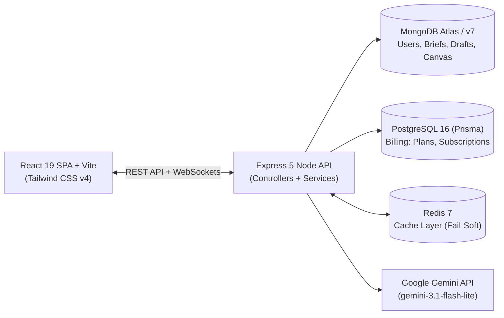

# Verve AI (BrandPilot-AI)

> **AI-Assisted Personal Branding & Multi-Platform Content Engine**

Verve AI helps professionals, developers, and creators turn their background into a structured **Brand Brief** (positioning statement, tagline, voice tone, target audience, and weighted content pillars), and then uses that brief as persistent context to generate platform-tailored social posts, auto-plan weekly schedules, brainstorm content angles, and optimize LinkedIn profiles.

---

## ⚡ Key Features

- **Brand Brief Engine:** A 5-step intake wizard that synthesizes user history and voice quiz results into a structured, editable strategic brand brief.
- **Content Studio:** Generates platform-specific posts for LinkedIn, Instagram, and Twitter with length controls (short/medium/long), tone overrides, and 8 one-click AI refinement actions (`add_hook`, `shorten`, `more_engaging`, etc.).
- **Weekly Planner:** AI auto-orchestrates an entire week of posts across platforms, pillars, and days; supports native HTML5 drag-and-drop rescheduling.
- **Brand Canvas:** Freeform sticky note and image upload board with AI theme extraction and content angle synthesis.
- **Profile Makeover:** Stateless rewrite tool for LinkedIn Headlines and About sections grounded in the user's stored Brand Brief.
- **Dual Datastore Persistence:** MongoDB for document-oriented brand entities, PostgreSQL via Prisma for relational billing records.
- **Real-Time Synchronization:** JWT-authenticated WebSockets (Socket.IO) syncing drafts across browser tabs with microtask batching.
- **Scoped SSR:** High-performance pre-rendered Landing page with client hydration fallback.

---

## 🏗️ Architecture Overview



---

## 🛠️ Technology Stack

- **Frontend:** React 19, Vite, React Router v7, Tailwind CSS v4, Axios, Socket.IO Client
- **Backend:** Node.js, Express 5, Mongoose 9, Prisma ORM 6, Socket.IO, Multer, Helmet
- **Databases:** MongoDB (Primary document store), PostgreSQL 16 (Billing store), Redis 7 (Cache)
- **AI Model:** Google Gemini (`@google/genai`, `gemini-3.1-flash-lite`)
- **Payments:** Stripe Node SDK (Checkout sessions & webhooks)
- **Email:** Nodemailer (SMTP password reset delivery with console fallback)

---

## 🚀 Getting Started

### 1. Prerequisites
- **Node.js:** v20+
- **MongoDB:** Running locally or MongoDB Atlas URI
- **PostgreSQL:** Running locally on port 5432

### 2. Environment Setup
Create the environment files from the provided templates:
```bash
# Backend environment (root)
cp .env.example .env

# Frontend environment
cp client/verve/.env.example client/verve/.env
```
*At minimum, set `MONGO_URI`, `JWT_SECRET`, and `GEMINI_API_KEY` in `.env`.*

### 3. Backend Setup
```bash
cd server
npm install
npx prisma generate
npm run db:migrate
npm run db:seed
npm run dev
```
*API runs on `http://localhost:5000` (Health check: `http://localhost:5000/api/health`).*

### 4. Frontend Setup
```bash
cd client/verve
npm install
npm run dev
```
*Application runs on `http://localhost:5173`.*

---

## 🐳 Docker Deployment

To launch the complete multi-container stack (MongoDB, PostgreSQL, Redis, API server, and Nginx client):
```bash
docker compose up -d
```
- Client accessible at `http://localhost:8080`
- API server accessible at `http://localhost:5000`

---

## 🧪 Testing & CI

- **Linting:** `cd client/verve && npm run lint`
- **Build Validation:** `cd client/verve && npm run build && npm run build:ssr`
- **CI Workflow:** Automated via GitHub Actions (`.github/workflows/ci.yml`) on pull requests to `main`.
- *Note: Automated unit/integration tests are currently not implemented (see [Documentation](docs/DOCUMENTATION.md#21-testing)).*

---

## 📂 Project Structure

```text
BrandPilot-AI/
├── client/verve/          # React 19 + Vite frontend application
│   ├── src/pages/        # Route components (Dashboard, ContentStudio, Planner, etc.)
│   ├── src/services/     # Axios client and Socket.IO connection
│   └── src/utils/        # Asynchronous coalescing, debounce, and backoff helpers
├── server/               # Express 5 REST API
│   ├── config/           # DB, Prisma, Redis, and index repair configurations
│   ├── controllers/      # Route controllers (auth, brand, content, billing, etc.)
│   ├── models/           # Mongoose schemas (User, BrandBrief, ContentDraft, CanvasNote)
│   ├── prisma/           # PostgreSQL schema and seed files
│   ├── prompts/          # Pure AI prompt builder functions
│   └── services/         # Gemini AI, Stripe, Socket, and Mailer integrations
├── docs/                 # Documentation directory
│   ├── DOCUMENTATION.md  # Master 34-section technical specification
│   └── README.md         # Documentation index and sitemap
└── docker-compose.yml    # Full-stack container orchestration
```

---

## 📖 Comprehensive Documentation

For complete technical details, consult the dedicated documentation files:
- **[Full System Documentation (`docs/DOCUMENTATION.md`)](docs/DOCUMENTATION.md)**: Exhaustive 34-section manual with architecture diagrams, schema specs, full API reference, error-handling flowcharts, and onboarding guides.
- **[High-Level Design (`HLD.md`)](HLD.md)**: Architectural patterns and design decisions.
- **[Low-Level Design (`LLD.md`)](LLD.md)**: Detailed schema fields, endpoint tables, and frontend JavaScript mechanics.
- **[Product Requirements (`PRD.md`)](PRD.md)**: User stories, functional requirements, and product goals.

---

## ⚠️ Known Limitations

1. **Manual Publishing:** No automated auto-posting to LinkedIn or Instagram APIs (posts are generated and copied by the user).
2. **Missing Client Billing UI:** PostgreSQL and Stripe billing routes exist on the backend, but the frontend currently lacks a dedicated `/billing` management screen.
3. **Local Storage for Canvas Images:** Canvas images are saved to `server/uploads/` on local disk storage rather than cloud object storage (S3/R2).

---

## 🤝 Contributing

1. Create a branch off `main`: `git checkout -b feature/<description>`.
2. Ensure code lints and builds cleanly before committing:
   - `cd client/verve && npm run lint && npm run build`
   - `cd server && node server.js`
3. Refer to **[CONTRIBUTING.md](CONTRIBUTING.md)** for detailed pull request guidelines.

---

## 📄 License
ISC License. See package configuration for details.
